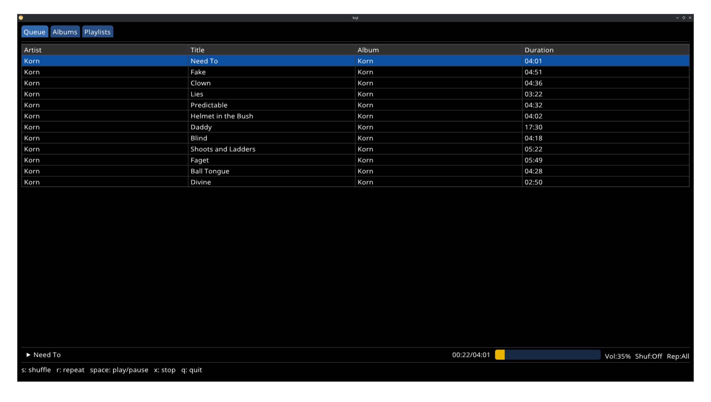
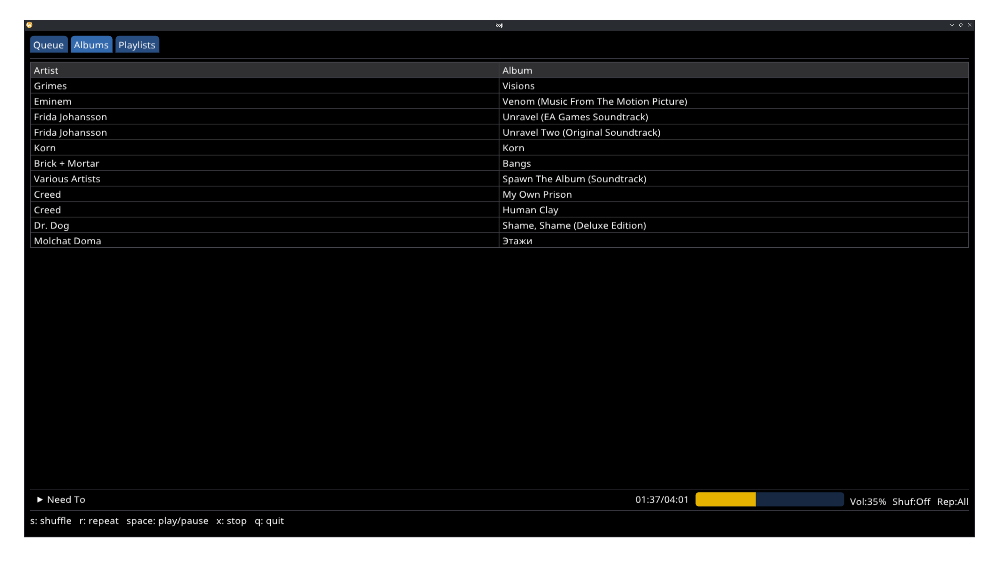
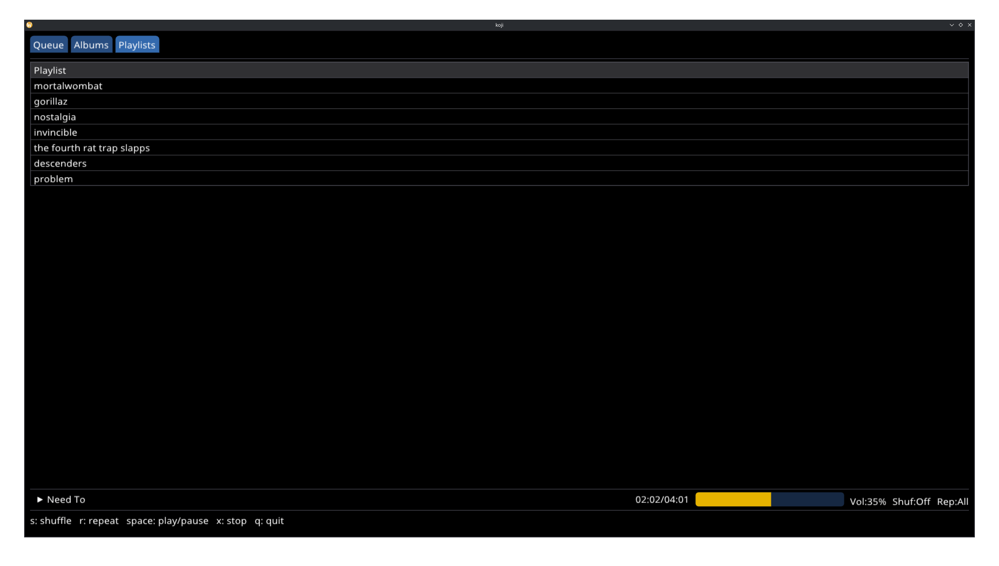

# Koji Music Player

Koji is a music player built with C++ and the ImGui library. 
It uses mpv for audio playback and SDL3 for window management. 

## Overview

- **Song Queue Tab**: Displays the current song queue and allows users to select songs to play.
- **Album Selection Tab**: Lists available albums and allows users to add all songs from an album to the queue.
- **Playlist Selection Tab**: Lists available playlists and allows users to add all songs from a playlist to the queue.

## Keybinding
- `S`: Toggle shuffle
- `R`: Toggle repeat mode
- `X`: Stop music
- `Space Bar`: Toggle pause
- `+`: Increase volume by 5%
- `-`: Decrease volume by 5%
- `Tab`: Cycle tabs
- `Right-Click`: Opens context popup when over an entry

## Features

### Shuffling 

In shuffle mode the song queue is randomly ordered. 
Any new albums or playlists added will be shuffled and appended to the queue.

### Repeat Mode 

There are three states: `Off`, `All`, and `Track`. 
`Off` will stop repeating after the current queue is finished. 
`All` will repeat the entire queue when the last song is reached. 
`Track` will repeat the current song forever.

### Queue Management

Songs can be added to the queue by selecting albums and playlists in the respective tabs. 
Shift clicking appends. 
Regular clicking replaces.

## Installation

```git clone https://github.com/GrayyGray/koji.git && make all && ./koji```


## File Formatting

Koji requires the following file formats for songs and playlists:

### Songs

Songs should be stored in the following directory structure: `~/.config/koji/albums/<artist>/<album>/<title>.<ext>`. As an example: `~/.config/koji/albums/Grimes/Visions/Infinite Love without Fulfilment.mp3`

Each song in the album needs to contain all of the following metadata tags:
- track
- title
- artist

### Playlists

Playlists should be stored as m3u's in the directory `~/.config/koji/playlists` with the following format: `~/.config/koji/playlists/<playlist_title>.m3u`

Each line in the playlist file should contain the path to a song in the directory `~/.config/koji/playlists/songs` with the following format: `<title>.<ext>`

Each song in the playlist needs to contain all of the following metadata tags:
- title
- album
- artist

## Screenshots





**[DISCLAIMER](docs/DISCLAIMER.md)**
